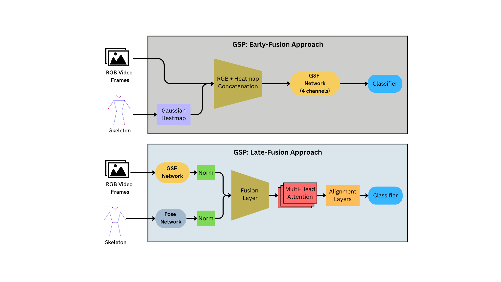

# Gate-Shift-Pose (GSP): Enhancing Action Recognition in Sports with Skeleton Information

This repository contains the implementation of **Gate-Shift-Pose (GSP)**, a multimodal architecture designed to enhance action recognition in sports by integrating skeleton-based pose information with RGB frames. The model builds on the **Gate-Shift-Fuse (GSF)** network and introduces early- and late-fusion strategies for improved fall classification in figure skating.

**Paper accepted at:** 2025 IEEE/CVF Winter Conference on Applications of Computer Vision Workshops (WACVW)

<p align="center">
📄 <a href="https://arxiv.org/abs/2503.04470">Read the Paper</a> | 🌐 <a href="https://edowhite.github.io/Gate-Shift-Pose">Project Page</a>
</p>



## Overview

Gate-Shift-Pose extends GSF by incorporating pose data to better capture the intricate motion dynamics of sports like figure skating. The two main fusion strategies explored are:

- **Early-Fusion**: Combines RGB frames with Gaussian heatmaps of pose keypoints at the input stage.
- **Late-Fusion**: Processes RGB frames and pose data in separate streams, combining them with multi-head attention and refinement layers.

This work demonstrates significant improvements in classification accuracy over RGB-only baselines using the FR-FS dataset.

## Key Features

- **Two Fusion Strategies**:
  - Early-Fusion: Efficient integration of RGB and pose at the input stage.
  - Late-Fusion: Contextual blending of RGB and pose features in later stages.
- **Pose Integration**:
  - Pose data preprocessed as Gaussian heatmaps (early-fusion).
  - Pose stream leveraging MLP-based embedding (late-fusion).
- **High Accuracy**:
  - Early-fusion with ResNet50 achieved 98.08% accuracy on the FR-FS dataset.

## Dataset

The FR-FS dataset is used for evaluation. It includes:

- **417 video samples**: 276 positive (fall) and 141 negative (non-fall).
- **Annotations**: 17 keypoints for pose estimation, RGB video frames.

For dataset details, visit the [FR-FS dataset repository](https://github.com/Shunli-Wang/TSA-Net).

## Usage

### Preprocessing

1. Process the FR-FS dataset:
   ```bash
   python process_dataset_FRFS.py
   ```

2. Extract pose keypoints from video frames:
   ```bash
   python preprocess_pose.py
   ```

### Training

Train the GSP model using early- or late-fusion strategies:
```bash
python main.py --arch resnet50 --batch-size 4 --num_segments 16 --lr 0.01 --epochs 120 --dropout 0.5 --weight-decay 5e-4 --warmup 10  --early_fusion_poses --num_channels 4 --gsf --gsf_ch_ratio 100 --dataset FRFS --dataset_path <dataset_path> --experiment_path <experiments path> --experiment_name <experiment name>
```

```bash
python main.py --arch resnet50 --batch-size 4 --num_segments 16 --lr 0.01 --epochs 120 --dropout 0.5 --weight-decay 5e-4 --warmup 10  --late_fusion_poses_attention --num_channels 3 --gsf --gsf_ch_ratio 100 --dataset FRFS --dataset_path <dataset_path> --experiment_path <experiments path> --experiment_name <experiment name>
```

It is also possibile to train using only the skeleton information (the --arch parameter will be ignored):
```bash
python main_only_pose.py --arch resnet50 --batch-size 16 --num_segments 16 --lr 0.001 --epochs 250 --dropout 0.5 --weight-decay 5e-4 --warmup 10  --num_channels 3 --gsf --gsf_ch_ratio 100 --dataset FRFS --dataset_path <dataset_path> --experiment_path <experiments path> --experiment_name <experiment name>
```

### Testing
```bash
python test_models.py --arch resnet50 --num_channels 4 --num_segments 32 --early_fusion_poses --num_clips 2 --test_crops 10 --gsf --gsf_ch_ratio 100 --dataset FRFS --dataset_path <dataset_path> --weights <path to pth.tar checkpoint> -j 8
```

## Results

| Backbone  | Fusion Type  | Batch Size | Segments | Accuracy (%) |
|-----------|--------------|------------|----------|--------------|
| ResNet18  | Early-Fusion | 8          | 32       | 81.25        |
| ResNet18  | Late-Fusion  | 4          | 32       | 95.19        |
| ResNet50  | Early-Fusion | 4          | 32       | **98.08**    |
| ResNet50  | Late-Fusion  | 8          | 32       | 87.02        |

## Citation
```
@InProceedings{Bianchi_2025_WACV,
    author    = {Bianchi, Edoardo and Lanz, Oswald},
    title     = {Gate-Shift-Pose: Enhancing Action Recognition in Sports with Skeleton Information},
    booktitle = {Proceedings of the Winter Conference on Applications of Computer Vision (WACV) Workshops},
    month     = {February},
    year      = {2025},
    pages     = {1257-1264}
}
```

## Acknowledgements
Based on: [Gate-Shift-Fuse for Video Action Recognition](https://arxiv.org/pdf/2203.08897.pdf), which is built upon the [TRN-pytorch](https://github.com/metalbubble/TRN-pytorch) codebase which is based on [TSN-pytorch](https://github.com/yjxiong/tsn-pytorch). We thank Yuanjun Xiong and Bolei Zhou for releasing TSN-pytorch and TRN-pytorch repos.
